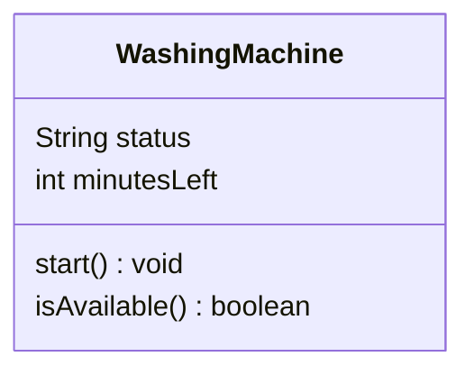

# Design — one object

Fill this in during Recitation 0. Everything in angle brackets is yours to replace.

## The object

<The washing machine in my dorm .>

## Its identity

<The serial number at the top, 2205012078.>

## Its one responsibility

<Its responsibility is to clean dirty laundery .>

## Class diagram

Replace `Example` below with your object. **State on top, behavior underneath.**

## What I am unsure about

<Weather if the door is locked or unlocked is part of the state or behavior .>
