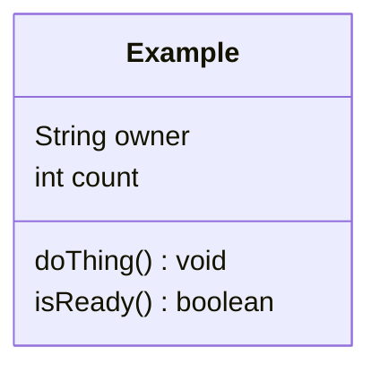

# Design — one object

Fill this in during Recitation 0. Everything in angle brackets is yours to replace.

## The object

<Which object? Pick a real thing from your own life — the one from Tuesday's exit
ticket is perfect. Not a thing from a program.>

## Its identity

<What makes this one different from every other one like it? A serial number, a name,
a seat number — whatever makes it *this* one and not a copy.>

## Its one responsibility

<One sentence, starting with a verb. If you need the word "and", you are probably
looking at two objects.>

## Class diagram

Replace `Example` below with your object. **State on top, behavior underneath.**

## What I am unsure about

<Anything you could not decide. Say so plainly — this is graded as honesty, not as
weakness.>
